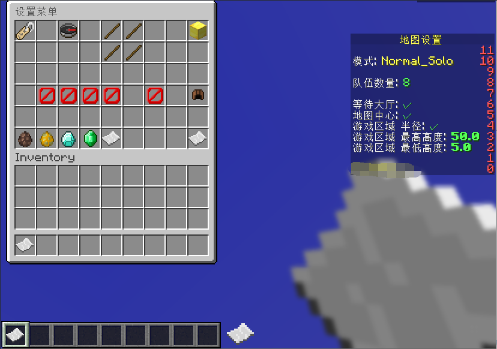

## 介绍
###### 这是一个高仿Hypixel起床战争小游戏的插件，
###### 制作他的原因仅仅闲着，而且网上并没有什么好的BedWars
###### 插件可以加入Bot进行游戏，完美解决服务器没有人的无法开启游戏的问题

#

##### Java版本:
###### | Java 8  (推荐Java 11)

##### Minecraft版本:
###### | 1.8.8 1.12.2 1.16.5 1.18.2 1.21.4

##### 数据储存方式:
###### | MongoDB, Redis(可选的)

##### 插件依赖：
###### | ProtocolLib, PlaceholderAPI, Citizens, LuckPerms, BadlionClientModAPI(可选的)

##### 支持系统：
###### | Windows, Linux

## 插件体验服务器
- ForGoal mc.forgoal.cn
- 一梦之初 mc3.cloudcatc.com

## 插件图片

## 更新日志

### 2023/6/22
- 首次发布

######

### 2023/6/22
- 修复快捷购买储存
- 永久工具无法移动

### 2023/6/24
- 修复了队伍分配人数与模式不匹配的问题
- 修复了单挑模式看不见其他队伍聊天的问题

### 2023/7/11
- 优化了旁观者的说话问题
- 增加了非游戏内玩家的旁观者状态
- 增加了最终死亡后的物品栏菜单
- 修复了死亡后可以会被攻击终止隐身效果的问题
- 修复了旁观者可以打人的问题
- 修复了旁观者可以打开末影箱和箱子的问题
- 修复了旁观者会被炸死的问题
- 修复了旁观者会被击退的问题
- 修复了药水显示时间的问题
- 修复了速度药水会有抗火增益的问题
- 修复了旁观者可以喊话的问题
- 修复了TNT爆炸伤害问题
- 修复了队伍资源池没有掉落限制

### 2023/7/12
- 优化了旁观者的Tab名字
- 修复了铁傀儡会打旁观者的问题
- 修复了床被破坏后计分板显然存活人数不正确的问题
- 修复了旁观者可以打火焰弹的问题
- 修复了游戏结算问题
- 修复了倒计时重新开始无法计时的问题
- 修复了已满人还能加入玩家的问题

### 2023/7/13
- 修复了旁观者会被火球击中的问题
- 修复了未设置地图无法进入的问题
- 修复了计分板信息显示的问题

### 2023/7/21
- 重命名了模式名字
- 修复了队伍分配玩家时不平衡的问题
- 修复了变量不正确的问题

### 2023/7/24
- 修改了配置文件的读取方法

### 2023/7/27
- 修改了地图刷怪的问题

### 2023/8/5
- 修复了商店购买的物品不能与掉落物品合并
- 修改了加入等待大厅看不见其他玩家的问题
- 新增了紧凑型塔防道具

### 2023/8/6
- 完善事件绝杀模式的末影龙
- 修复了NPC重叠的问题

### 2023/8/25
- 新添加了任务系统
- 修复了大厅NPC第一次进去全息不显示的问题

### 2023/9/9
- 修复了结算时显示为Null的问题

### 2023/10/28
- 优化了击杀判定系统
- 增加了破坏床特效
- 增加了击杀信息特效
- 修复了搭桥蛋无法使用的问题
- 修复了弓箭可以攻击队友的问题

### 2023/12/1
- 修改了指令没有注册的问题

### 2023/12/3
- 移除了ServerInfoUploadEvent开发API
- 添加CustomConfigEvent开发API
- 修复了搭桥蛋无法使用的问题
- 修复了紧凑型塔防的价格问题
- 修复了紧凑型塔防无法使用的问题
- 修复了特效KillMessage显示错误的问题
- 修复了玩家自己击杀自己的问题

### 2023/12/23
- 添加了最终击杀特效
- 添加了游戏等级结算
- 添加了首次加入起床战争的首次奖励
- 添加了硬币指令
- 修复了指令补齐

### 2023/12/29
- 修复了升级与陷阱商店疯狂矿工价格与实际不符的问题
- 增加了Bot游戏

### 2024/1/12
- 添加配置地图菜单
- 修复了死亡后不能捡东西的问题

### 2024/1/14
- 修复了隐私药水结束后无法看到护甲和Tag的问题
- 修复自己杀死自己的问题
- 修复了正常击杀会出现最终击杀特效的问题
- 修复了陷阱无法触发的问题

### 2024/1/15
- 修复了击杀判断
- 修复了队伍分配不平均的问题

### 2024/1/17
- 修复了最终击杀后队伍人数不减少的问题

### 2024/1/18
- 增加了旁观者传送菜单
- 修复了设置菜单有些队伍无法切换出来的问题

### 2024/1/19
- 修复了设置菜单无法设置资源池的问题

### 2024/1/20
- 修复了玩家游玩人数显示不正常的问题

### 2024/1/21
- 优化了BOT的名字
- 优化了开始倒计时系统
- 优化了匹配地图随机系统
- 优化了TabList的显示名字
- 优化了聊天名字显示
- 修复了被淘汰玩家的游戏结束提示
- 修复了旁观者放置物品其他人会听到放声音

### 2024/2/2
- 修复了某些模式下的绿宝石可生成可保留10个
- 增加了指南针队伍追踪器

### 2024/2/3
- 添加了对BadlionClientModAPI的支持
- 添加了半成品40v40城池攻防模式
- 修复了队伍升级队伍其他玩家不更新增益的问题
- 修复了商店工具初始附魔不显示的问题
- 修复了剪刀死亡后会消失的问题

### 2024/2/4
- 添加了城池模式的金库

### 2024/2/10
- 修复了大厅bwsetup指令报错的问题

### 2024/2/16
- 添加了重连指令
- 添加了隐身脚步
- 添加了权限强开节点
- 添加了建筑高度限制
- 添加了队伍箱子打开检测
- 添加了资源商店购买资源文字颜色
- 添加了商店选择当前类别玻璃板颜色
- 添加了玩家掉入虚空时禁止丢弃物品
- 修复了搭桥蛋会消耗两个的问题
- 修复了火球对着地板会消耗的问题
- 修复了火焰弹可以炸死自己或者队友
- 修复了多中心下治愈池生命回复有问题

### 2024/3/7
- 优化了化妆品菜单
- 增加了化妆品指令
- 修复了旁观者有隐身脚步的问题

### 2024/3/30
- 添加了胜利之舞烟花
- 修复了防爆玻璃无效的问题
- 优化了特效菜单的排版

### 2024/3/31
- 更新了胜利之舞部分特效
- 更新了死亡音效特效
- 更新了弹射物轨迹
- 优化了胜利之舞烟花

### 2024/4/27
- 更新了千米模式
- 更新了无虚空模式
- 更新了枪械起床模式
- 优化了4v4模式

### 2024/6/16
- 更新了数据库以及API
- 修复了4v4v4v4的变量不工作的问题
- 修复了个人信息菜单4v4数据位置不正确的问题

### 2024/6/17
- 移除了CustomConfigEvent开发API
- 添加了APIRunnable开发API
- 移除了旧的配置地图指令

### 2024/6/18
- 增加了MongoDB数据库的支持(只支持玩家数据)
- 修复了第一次加入时奖励重复出现的问题

### 2024/6/21
- 增加了2种弹射物特效
- 优化了优化物品交互功能
- 添加了部分梦幻模式信息统计
- 添加了再来一局的旁观者物品
- 添加了支持添加菜单下面绿宝石lore自定义链接

### 2024/6/22
- 添加了木板皮肤特效
- 添加了幸运方块模式
- 添加了旁观者设置的菜单
- 修复了BOT指令权限的问题
- 修复了弹射物轨迹不生效问题

### 2024/6/23
- 修复了幸运方块统计不显示头颅模型问题
- 修复了幸运方块队伍升级价格问题
- 修复了幸运方块产卵是绿宝石问题
- 修复了亡语不生效问题

### 2024/6/24
- 重做了蝙蝠十字架特效
- 修复了兔兔爆炸无法购买问题
- 重做了黑色标记特效修复无法购买问题

### 2024/6/25
- 修复了购买队伍升级熔炉过快导致资源池不工作的问题

### 2024/7/22
- 增加了BOT判断是否已经瞄准攻击目标
- 优化了BOT攻击BOT时的击退

### 2024/7/28
- 修复了无法匹配地图的问题

### 2024/7/29
- 添加了玩家掉出地图最低高度检测
- 添加了方块放置地图最低高度检测限制
- 增加了玩家在游戏中升级后结算时提升升级
- 修复了搭桥蛋无法使用的问题
- 修复了火焰弹无法使用的问题
- 修复了BOT卡在虚空无法死亡的问题
- 修复了疾速起床建桥模式无法使用的问题

### 2024/8/15
- 增加了指令打开任务菜单
- 修复了一个指令权限的问题
- 修正了任务重置时间

### 2024/8/19
- 修复了NPC会被炸飞的问题
- 修复了重连后购买的永久工具无法使用的问题

### 2025/1/18
- 优化了隐身脚步

### 2025/1/21
- 修复了防爆玻璃不生效的问题

### 2025/2/21
- 添加了多地图配置并可以智能加载模式
- 优化了性能游戏结束后无需重启服务器
- 删除了MySQL数据库支持

### 2025/3/1
- 添加了自定义NPC皮肤
- 修复了一个严重的数据问题

### 2025/3/30
- 添加了MineCraft 1.12.2的版本支持
- 添加了MineCraft 1.16.5的版本支持
- 修复了匹配报错的问题
- 修复了配置地图指令

### 2025/4/1
- 添加了MineCraft 1.18.2的版本支持

### 2025/4/22
- 添加了对MineCraft 1.18.2全息的支持
- 修复了MineCraft 1.18.2队伍商店无法使用的问题
- 修复了NPC位置移动后不恢复的问题

### 2025/4/24
- 修复了MineCraft 1.18.2+的版本购买护甲的问题

### 2025/4/25
- 修复了高版本紧凑型塔防
- 修复了高版本搭桥蛋
- 修复了观战无法正常加入的问题

### 2025/4/26
- 添加了MineCraft 1.21.4的版本支持
- 优化了追踪器 不在显示已经团灭的队伍

## BUG与需求
- 奖励箱
- 队伍轮换
- 木板特效
- 添加配置最低开始人数
